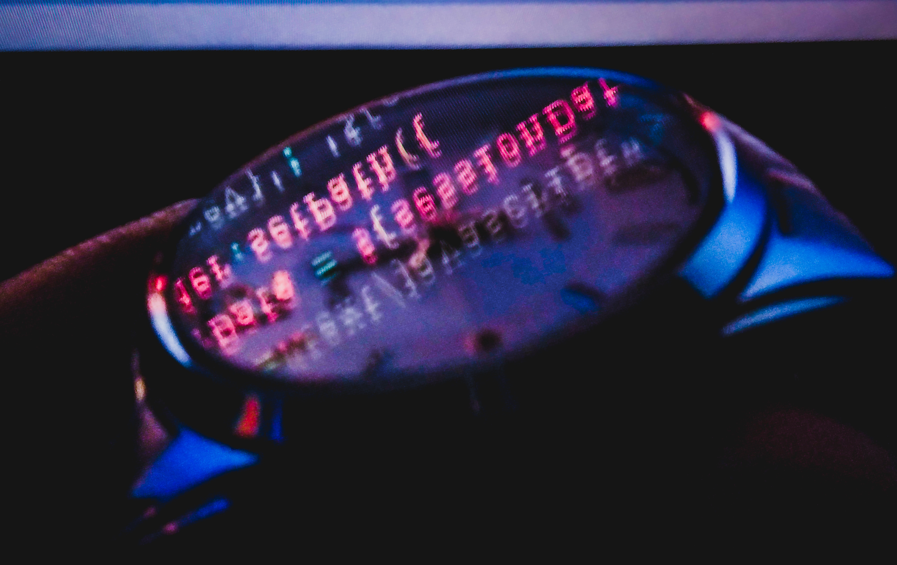

## Ako si [Jepoy](https://github.com/je-poy)


<!--START_SECTION:waka-->


**🐱 My Github Data** 

> 🏆 110 Contributions in the Year 2020
 > 
> 📦 63.8 kB Used in Github's Storage 
 > 
> 🚫 Not Opted to Hire
 > 
> 📜 16 Public Repositories
 > 
> 🔑 6 Private Repositories 

**I'm an Early 🐤** 

```text
🌞 Morning    21 commits     ███░░░░░░░░░░░░░░░░░░░░░░   14.29% 
🌆 Daytime    82 commits     ██████████████░░░░░░░░░░░   55.78% 
🌃 Evening    44 commits     ███████░░░░░░░░░░░░░░░░░░   29.93% 
🌙 Night      0 commits      ░░░░░░░░░░░░░░░░░░░░░░░░░   0.0%

```
📅 **I'm Most Productive on Wednesday** 

```text
Monday       31 commits     █████░░░░░░░░░░░░░░░░░░░░   21.09% 
Tuesday      30 commits     █████░░░░░░░░░░░░░░░░░░░░   20.41% 
Wednesday    38 commits     ██████░░░░░░░░░░░░░░░░░░░   25.85% 
Thursday     26 commits     ████░░░░░░░░░░░░░░░░░░░░░   17.69% 
Friday       22 commits     ███░░░░░░░░░░░░░░░░░░░░░░   14.97% 
Saturday     0 commits      ░░░░░░░░░░░░░░░░░░░░░░░░░   0.0% 
Sunday       0 commits      ░░░░░░░░░░░░░░░░░░░░░░░░░   0.0%

```


📊 **This Week I Spent My Time On** 

```text
⌚︎ Time Zone: Asia/Manila

💬 Programming Languages: 
JSX                      12 hrs 19 mins      █████████████████████░░░░   84.67% 
Other                    50 mins             █░░░░░░░░░░░░░░░░░░░░░░░░   5.83% 
Vue.js                   41 mins             █░░░░░░░░░░░░░░░░░░░░░░░░   4.69% 
CSS                      18 mins             ░░░░░░░░░░░░░░░░░░░░░░░░░   2.09% 
JavaScript               14 mins             ░░░░░░░░░░░░░░░░░░░░░░░░░   1.66%

🔥 Editors: 
VS Code                  14 hrs 33 mins      █████████████████████████   100.0%

🐱‍💻 Projects: 
je-poy.github.io.react   13 hrs 8 mins       ██████████████████████░░░   90.28% 
scinnova-onlinestore-admi55 mins             █░░░░░░░░░░░░░░░░░░░░░░░░   6.3% 
scinnova-online-store-api20 mins             ░░░░░░░░░░░░░░░░░░░░░░░░░   2.36% 
scinnova-marketplace-func4 mins              ░░░░░░░░░░░░░░░░░░░░░░░░░   0.54% 
pms                      4 mins              ░░░░░░░░░░░░░░░░░░░░░░░░░   0.51%

💻 Operating System: 
Windows                  14 hrs 33 mins      █████████████████████████   100.0%

```

**I Mostly Code in JavaScript** 

```text
JavaScript               7 repos             ██████████████░░░░░░░░░░░   58.33% 
PHP                      3 repos             ██████░░░░░░░░░░░░░░░░░░░   25.0% 
CSS                      1 repo              ██░░░░░░░░░░░░░░░░░░░░░░░   8.33% 
HTML                     1 repo              ██░░░░░░░░░░░░░░░░░░░░░░░   8.33%

```


**Timeline**

 


<!--END_SECTION:waka-->

- 📫 How to reach me: <br />
[](https://dev.to/jepoy)
<!--
**je-poy/je-poy** is a ✨ _special_ ✨ repository because its `README.md` (this file) appears on your GitHub profile.

Here are some ideas to get you started:

- 🔭 I’m currently working on ...
- 🌱 I’m currently learning ...
- 👯 I’m looking to collaborate on ...
- 🤔 I’m looking for help with ...
- 💬 Ask me about ...

- 😄 Pronouns: ...
- ⚡ Fun fact: ...
-->
